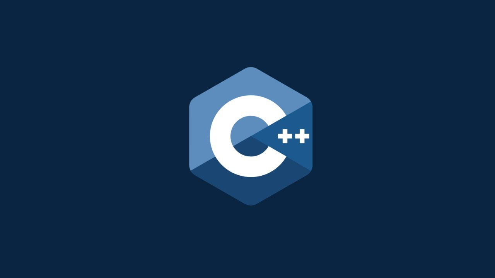

# Skillbox Search Engine
_by Stanislav Novozhilov ("prorok")_
___

### Итоговый проект курса: Профессия Разработчик на C++ с нуля 
платформы Skillbox - корпоративный поисковый движок.
Проект содержит три основных класса ___"Converterjson.h"___, ___"Invertedindex.h"___, ___"SearchServer.h"___.

класс ___ConvertedJson___ имеет методы, позволяющие извлекать данные из JSON-файлов, и наоборот, 
конвертировать и сохранять данные в JSON-файлы.

класс ___InvertedIndex___ имеет методы, позволяющие обновлять базу данных документов, и получать
количество вхождений слова в тексте документов из базы данных.

класс ___SearchServer___ имеет единственный метод поиска и вычисления релевантности документов 
на основе полученных запросов.
___
Проект для сборки использует: 
1. [CMake версии 3.27](https://cmake.org/download/),
2. для компиляции используется 
[MinGW версии 11.0 w64](https://github.com/niXman/mingw-builds-binaries/releases/tag/13.2.0-rt_v11-rev1),
3. С++ стандарт 23.

В проекте использовались:
1. библиотека ___[nlohmann/json](https://github.com/nlohmann/json?ysclid=lrq5qo3vz517308901)___ для работы с форматом JSON.
2. библиотека ___[Google Tests](https://github.com/google/googletest?ysclid=lrq6bc00wy323673298)___ 
для тестирования отдельных модулей проекта. 
___